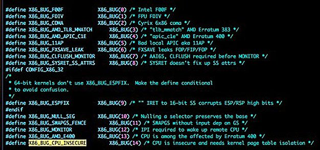
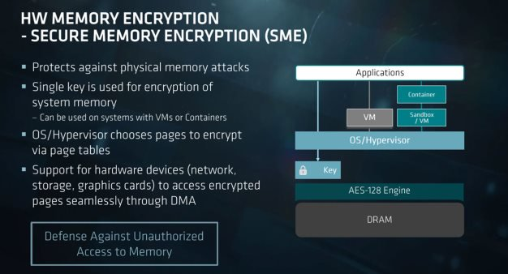

# Intel признала уязвимость в процессорах трех последних поколений

​	Компания Intel предупредила производителей оборудования и пользователей, что в ряде ее процессоров содержатся программные уязвимости, теоретически позволяющие злоумышленникам исполнять на компьютерах произвольный код в обход операционной системы.

​	

​	В числе затронутых уязвимость чипов — все процессоры Intel Core 6-го, 7-го и 8-го поколений. Эксперты уже давно предупреждали, что Intel Management Engine, являясь крайне удобным инструментом для администраторов, в случае уязвимости становится настоящим подарком для пытающихся получить контроль над компьютером хакеров.

​	**Затронутые продукты:**

- Семейство процессоров Intel® Core ™ от 1-го, 2-го, 3-го, 4-го, 5-го, 6-го, 7-го и 8-го поколений;
- Процессор Intel® Xeon® E3-1200 v5 & v6 Семейство продуктов;
- Масштабируемая семейство процессоров Intel® Xeon®;
- Семейство процессоров Intel® Xeon® W;
- Процессор Intel® Pentium® серии G;
- Семейство процессоров Intel® Atom® C3000;
- Apollo Lake Процессор Intel® Atom серии E3900;
- Apollo Lake Intel® Pentium ™;
- Процессоры Celeron ™ G, N и J;

​	В выпущенном Intel бюллетене безопасности говорится о новых обнаруженных уязвимостях в Management Engine, в инструменте для удаленного управление серверами Server Platform Services и инструменте аутентификации Trusted Execution Engine. Компания также выпустила программный инструмент для Windows- и Linux-систем, позволяющий администраторам выяснить, подвержены ли они уязвимости.

​	Management Engine (ME) — независимая подсистема управления, располагающаяся в отдельном микропроцессоре на системных чипсетах Intel. Она создана, чтобы администраторы могли управлять удаленно всеми функциями устройств, включая установку обновлений и устранение сбоев. Из-за такого "всевластия" ME над системами ПК — через нее проходит большая часть данных, передающихся между ЦП и внешними устройствами — многие эксперты по безопасности называли ее не иначе как "бэкдором", то есть "черным ходом" для хакеров или спецслужб. Проблема усугублялась тем, что Intel избегает подробного описания механизмов работы ME, ссылаясь на нежелание раскрывать особенности технологии конкурентам.

​	Intel выпустила загружаемый инструмент обнаружения, расположенный по адресу [http://www.intel.com/sa-00086-support](https://translate.googleusercontent.com/translate_c?act=url&depth=1&hl=ru&ie=UTF8&prev=_t&rurl=translate.google.com&sl=en&sp=nmt4&tl=ru&u=http://www.intel.com/sa-00086-support&usg=ALkJrhigeF7LtGyOFgPkhwU915y2GVwXlA) , который проанализирует вашу систему на наличие уязвимостей, указанных в этом совете по безопасности.

​	Единственный способ восстановления системы в ее полностью функциональном состоянии - обновить как прошивку Intel® ME, так и программное обеспечение iCLS, чтобы подтвердить надлежащее повторное предоставление платформы.

**Так чем же опасна уязвимость?**

​	Чтобы обезвредить уязвимость, память ядра нужно изолировать от пользовательских процессов с помощью механизма Kernel Page Table Isolation. Патч переместит ядро в полностью изолированное адресное пространство. То есть, оно не просто станет невидимым для процессов, а вообще перестанет в них присутствовать, пишет The Register.

​	В результате переключение между режимом пользователя и режимом ядра начнет занимать гораздо больше времени, поскольку процессору придется сбрасывать кэшированные данные и перезагружать информацию из памяти. Это может привести к потери производительности на различных устройствах. По данным The Register, Linux и Windows угрожает замедление работы от 5% до 30%. По macOS данных пока что нет.

​	Потеря производительности будет зависеть от конкретной модели процессора и выполняемой им в данный момент задачи. Более новые процессоры Intel имеют такие функции как идентификаторы процессов и контекстов (PCID), которые должны помочь уменьшить спад производительности.

​	Под удар, в первую очередь, могут попасть компании, использующие виртуализацию. Есть повод подозревать, что уязвимы популярные окружения для виртуализации, включая Amazon EC2 и Google Compute Engine.

​	Microsoft Azure и Amazon Web Services уже запланировали временное отключение серверов , хоть и не дают комментариев по поводу причины работ. Однако, вероятно, именно необходимость защититься от возможных атак с использованием найденной уязвимости является его причиной.

Также могут быть следующие сценарии, в которых успешный атакующий мог:

1. обойти ME / SPS / TXE, тем самым влияя на достоверность аттестации на локальную безопасность;
2. вызвать сбой системы или нестабильности системы;
3. Загружать и выполнять произвольный код вне видимости пользователя и операционной системы.

**Уязвимы ли процессоры AMD?**

​Заметим, что AMD пока не упоминалась ни разу. Всё просто: процессоры AMD не подвержены данной уязвимости — а, следовательно, и не нуждаются в ресурсоёмкой защите от неё.

​Томас Лендаки, участник работающей с Linux группы в AMD, сообщает:

«Процессоры AMD не подвержены атакам, от которых защищает изоляция памяти ядра. Архитектура AMD не позволяет получить доступ к данным при отсутствии соответствующих привилегий.»

​	К тому же, новые серверные чипы EPYC от AMD, а также их десктопные процессоры Ryzen Pro имеют технологию шифрования защищённой памяти, дающую дополнительную защиту от атак подобного рода.

​	**Шифрование защищённой памяти -**процессоры  AMD, серия EPYC 7000 также оснащена встроенным процессором безопасности платформы. Но EPYC также использует шифрование аппаратной памяти для предотвращения атак физической памяти. Secure Memory Encryption или SME предназначен для защиты от несанкционированного доступа к памяти, но все же позволяет использовать аппаратные устройства, такие как доступ к зашифрованным страницам через DMA (прямой доступ к памяти).

​	**Secure Memory Encryption:**

1. Защищает от атак физической памяти;'
2. Один ключ используется для шифрования системной памяти. Может использоваться в системах с виртуальными машинами или контейнерами;
3. OS / Hypervisor выбирает страницы для шифрования через таблицы страниц;
4. Поддержка аппаратных устройств (сети, хранилищ, видеокарт) для беспрепятственного доступа к зашифрованным страницам через DMA.

**СПИСОК ЛИТЕРАТУРЫ:**

- AMD Developer Central: [Developer Central](https://developer.amd.com/)

- Поддержка Intel:https://www.intel.ru/content/www/ru/ru/homepage.html

- AMD процессоры: https://hothardware.com/reviews/amd-epyc-7000-series-processor-and-platform-details?page=2

- Журнал Geektimes:https://geektimes.ru/ 

- Secure Memory Encryption:https://en.wikichip.org/wiki/x86/sme 

