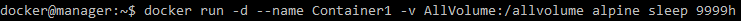
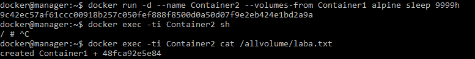
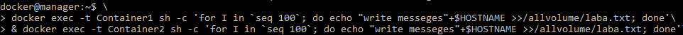
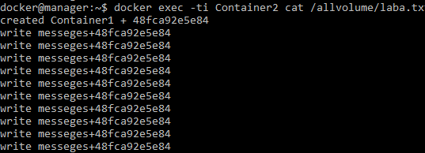
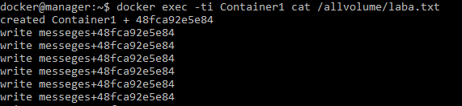

# Проектирование облачной файловой системы

## Построение общего хранилища для контейнеров

 	Для начала мной был создан том AllVolume при помощи команды:

​     `*docker volume create --name AllVolume*`

​	Далее мной был создан и запущен первый контейнер 1, с примонтированным к нему томом AllVolume. Использованная команда (где sleep — unix-утилита, выполняющая задержку на указанное время (9999 часов в нашем случае)):

`docker run -d --name=Container1 -v AllVolume:/allvolume alpine sleep 9999h`

​	Продемонстрируем выполнение этой команды:

​	После заходим в контейнер 1, набрав следующую команду:

`docker exec -ti Container1 sh`

и далее с помощью следующей команды создаём файл laba.txt в котором записываем "created Container1", а также просмотрим содержимое данного файла:

`echo "created Container1"+$HOSTNAME > /allvolume/laba.txt`

`cat /allvolume/laba.txt`

​	Продемонстрируем выполнение этих действий скриншотом:

​	Далее был создан запущен контейнер 2 с примонтированным ранее созданным томом AllVolume. Использованная команда:

`docker run -d --name=Container2 --volumes-from Contaier1 alpine sleep 9999h`

​	Продемонстрируем выполнение этих действий скриншотом:

​	Теперь для проверки работы, когда данные записываются в один общий файл, который находится в контейнерах, одновременно запустим цикл :

​	Далее с помощью следующей команды увидим, что  при записи никого конфликта не происходит:

`docker exec -ti Container2 cat /allvolume/laba.txt`

Посмотрим результат:

*Вывод:*  В данной работе мы построенили общее хранилища для контейнеров, где создали два контейнера. Так же доказали, что во время одновременной отработки циклов записи из двух контейнеров в 1 файл, конфликтов не происходит и все строки записываются в файл по мере вызова соответствующей команды, вне зависимости от того как запись происходит одновременно или поочерёдно.

​                             

