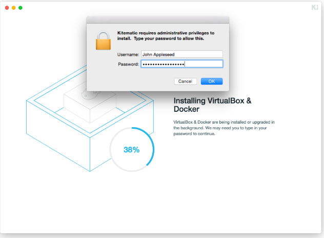

# Исследование интерфейсов для управления облачными системами

​	 Рассмотрим наиболее популярные интерфейсы и приведём их в таблицу:

| Интерфейсы для управления |            ОС            |                Платформа                 |             Краткое описание             |
| :-----------------------: | :----------------------: | :--------------------------------------: | :--------------------------------------: |
|       **Portainer**       | Linux, Mac OS X, Windows |         Go, JavaScript (Angular)         | Web-интерфейс для работы с Docker-хостами и кластерами Docker Swarm. Позволяет управлять контейнерами, образами (умеет забирать их из Docker Hub), сетями, томами. При просмотре контейнеров для каждого из них доступна базовая статистика (использование ресурсов, процессы), логи, подключение к консоли (веб-терминал xterm.js). |
|   **Simple Docker UI**    | Linux, Mac OS X, Windows | Electron, Scala.js (+ React on Scala.js) | Простой интерфейс для работы с Docker, использующий Docker Remote API. Позволяет управлять контейнерами и образами (с поддержкой Docker Hub), подключаться к консоли, просматривать историю событий. Имеет механизмы удаления неиспользуемых контейнеров и образов. Проект находится в бета-версии и развивается очень медленно. |
|      **DockStation**      | Linux, Mac OS X, Windows |       Electron (Chromium, Node.js)       | Молодой проект, две главные особенности — ориентированность на разработчиков (не на DevOps-инженеров или сисадминов) с полноценной поддержкой Docker Compose и закрытость кода (бесплатно для использования, а за деньги авторы предлагают персональную поддержку и доработку возможностей). Позволяет не только управлять образами (поддерживается Docker Hub) и контейнерами (+ статистика и логи), но и заводить проекты с визуализацией связей контейнеров, задействованных в проекте. |
|        **Admiral**        | Linux, Mac OS X, Windows |      Java (фреймворк VMware Xenon)       | Платформа от VMware, предназначенная для автоматизированного деплоя контейнеризированных приложений и управления ими на протяжении жизненного цикла. Позиционируется как легковесное решение, призванное упростить жизнь DevOps-инженерам. Веб-интерфейс позволяет управлять хостами с Docker, контейнерами (+ просмотр статистики и логов), шаблонами (образы, интегрированные с Docker Hub), сетями, реестрами, политиками (какие хосты какими контейнерами будут использоваться и как распределять ресурсы). Умеет проверять состояние контейнеров (health checks). |
|       **Shipyard**        |     Linux, Mac OS X      |               Go, Node.js                | Система управления ресурсами Docker, в основу которой заложено наличие своего API. API в Shipyard — RESTful на базе формата JSON, совместим на 100% с Docker Remote API, предлагает дополнительные возможности (в частности — аутентификацию и управление списками доступа, логирование всех выполняемых операций). Этот API и является той базой, вокруг которой уже построен веб-интерфейс. |
|      **Kitematic **       |    Mac OS X, Windows     |     Electron, Node.js, React и AltJS     | Стандартный GUI для пользователей Docker в Mac OS X и Windows, который вошёл в состав Docker Toolbox — инсталлятора набора утилит, включающих в себя также Docker Engine, Compose и Machine. |

​	Из этого  списка я выбрал первый вариант, так как им я уже пользуюсь, это  Kinematic. В данном случае этот интерфейс ставится достаточно быстро и просто.

​	Открытие Kitematic в первый раз устанавливает все необходимое для запуска контейнеров Docker. Если вы еще не установили VirtualBox, Kitematic загрузит и установит последнюю версию.

Все сделано! Через минуту вы должны быть готовы начать свой первый контейнер!

Технические подробности.

Китематик является автономным .app, за двумя исключениями:

- [ ] Он установит VirtualBox, если он еще не установлен;
- [ ] Он копирует двоичные файлы `docker` и `docker-machine` в `/usr/local/bin` для удобства.

## Вывод:

В рамках выполнения лабораторной были выявленны следующие особенности:

- [ ] Интерфейсы позволяют работать с удаленной средой Docker;
- [ ] Существует достаточно большое количество различных интерфейсов, которые написаны на различных языках, могут работать в разных операционных системах, а так же распостраняются по различным лицензиям;
- [ ] есть интерфейс, которые можно достаточно быстро установить и приступить к работе.

